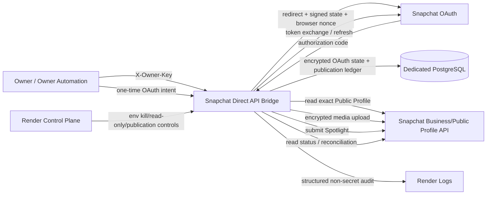

# SNAPCHAT ARCHITECTURE / DATA FLOW / TRUST BOUNDARIES — 2026-09-28

PROJECT: Trend Radar / TrendHunter  
SCOPE: Snapchat only  
STATUS: REMEDIATION CANDIDATE DOCUMENTATION

## Architecture



## Trust boundaries

### TB1 — Internet -> Render web service

Untrusted:
- HTTP headers
- form fields
- uploaded media
- publication/content/job identifiers
- OAuth callback query parameters

Controls:
- owner authorization for owner/admin/publish surfaces;
- request-size limits;
- strict identifier formats;
- media probing;
- fail-closed error handling;
- no secret response bodies.

### TB2 — OAuth browser -> callback

Untrusted until consumed:
- authorization code
- state
- browser cookie

Controls:
- owner-generated one-time OAuth intent;
- signed state;
- durable state hash;
- browser-bound nonce hash;
- one-time consumption;
- TTL;
- exact profile binding before token persistence.

### TB3 — Application -> PostgreSQL

Security role:
- durable OAuth connection state;
- durable publication identity;
- duplicate prevention;
- unknown-state recovery;
- hard-limit counters.

Production rule:
- PostgreSQL only;
- SQLite is test/dev only and is rejected by the production gate.

### TB4 — Application -> Snapchat

Requests:
- OAuth token exchange / refresh;
- exact Public Profile read;
- Spotlight authorized-access read;
- media creation;
- encrypted multipart upload;
- Spotlight submission;
- status/reconciliation reads.

Controls:
- expected Public Profile ID;
- expected username trendradarar;
- single scope target: snapchat-profile-api;
- business API upload-host restriction;
- timeouts;
- durable state transition before remote submit.

### TB5 — Render control plane -> application

Controls:
- publication enabled;
- kill switch;
- emergency read-only;
- target binding verification;
- reconciliation readiness;
- alert readiness;
- production assurance readiness;
- hard-limit verification.

A compromised publisher must additionally be stoppable from the hosting control plane. Practical independent service-stop drill remains an acceptance item.

## External entry points

Public read-only:
- GET /
- GET /health

OAuth:
- POST /admin/oauth-intent — owner protected
- GET /auth/start — requires one-time intent
- GET /auth/callback — requires valid signed/browser-bound one-time state

Owner-protected reads/controls:
- GET /admin/token-status
- POST /admin/disconnect
- GET /readiness/profile-binding
- GET /profiles/{profile_id}
- GET /spotlight/status/{spotlight_id}
- GET /admin/publications/{publication_id}
- POST /admin/publications/{publication_id}/reconcile

Owner-protected validation/mutation:
- POST /spotlight/validate
- POST /spotlight/publish

## OAuth data flow

1. Owner-authenticated client requests one-time OAuth intent.
2. Server stores only an intent hash + expiry.
3. Browser consumes intent at /auth/start.
4. Server creates signed OAuth state + random browser nonce.
5. Server persists state hash + browser nonce hash + expiry.
6. Browser receives secure HttpOnly SameSite=Lax nonce cookie.
7. Snapchat returns code + state.
8. Callback validates signature + browser nonce + one-time durable state.
9. Server exchanges authorization code.
10. Server verifies required scope.
11. Server reads exact expected Public Profile.
12. Server verifies Public Profile ID and username.
13. Server verifies read access to the exact profile Spotlight surface.
14. Only then are access/refresh credentials encrypted and stored.

## Publication data flow

1. Owner-authorized request supplies:
   - publication_id
   - content_id
   - job_id
   - description
   - locale
   - MP4 file
2. Full production gate is evaluated.
3. Exact bound Public Profile is re-read.
4. Authorization decision is audited.
5. MP4 bytes are persisted only in temporary process storage.
6. Actual duration/resolution is probed.
7. SHA-256 of media bytes is computed.
8. PostgreSQL admission transaction:
   - checks duplicate publication identity;
   - checks immutable payload binding;
   - checks concurrency/hour/day limits;
   - creates RECEIVED record.
9. Durable state advances to VALIDATED.
10. AES-256-CBC media container is generated.
11. Snapchat media object is created.
12. Durable state records remote media ID.
13. Encrypted media is multipart uploaded/finalized.
14. Durable state changes to SUBMITTING BEFORE remote Spotlight POST.
15. Spotlight POST is performed.
16. On confirmed success, remote Spotlight ID is persisted and state becomes SUBMITTED.
17. On uncertainty during submit, state becomes UNKNOWN where possible.
18. No blind retry from UNKNOWN/SUBMITTING.
19. Reconciliation resolves remote state or retains UNKNOWN.

## Publication state machine

```text
RECEIVED
  -> VALIDATED
  -> MEDIA_CREATING
  -> MEDIA_UPLOADING
  -> SUBMITTING
       -> SUBMITTED
            -> LIVE
            -> REJECTED
       -> UNKNOWN

Pre-submit failure:
RECEIVED / VALIDATED / MEDIA_CREATING / MEDIA_UPLOADING
  -> FAILED_PRE_SUBMIT
  -> limited identical-payload retry only
```

Forbidden automatic transition:
- UNKNOWN -> new publish attempt
- SUBMITTED -> new publish attempt
- LIVE -> new publish attempt
- same publication_id -> different content/job/media

## Persistent publication identity

Primary key:
- profile_id + publication_id

Bound evidence:
- content_id
- job_id
- description hash
- media SHA-256
- probed media duration
- probed dimensions
- attempt count
- correlation ID
- remote media ID
- remote Spotlight ID
- local state
- UTC timestamps

## Recovery boundary

Source recovery:
- owner-controlled GitHub

Runtime recovery:
- owner-controlled Render workspace or clean replacement host

State recovery:
- dedicated Snapchat PostgreSQL backup

Identity recovery:
- Snapchat account + Business Organization + OAuth app + project recovery email

The subsystem is not considered recoverable merely because source code exists. Source, state, external identity, secrets, and independent retest all matter.
